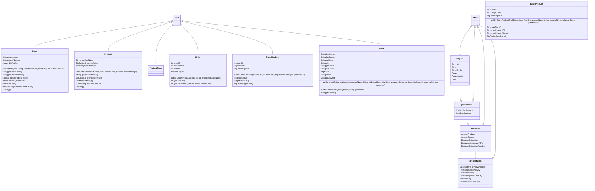

# COMP3350 G06 Iteration 1
## GoCart Architecture
Due: February 12th, 2023

### Packages
* Application
* Business(comp3350.GoCart.objects)
* Objects(comp3350.GoCart.objects)
* Persistence(comp3350.GoCart.persistence)
    * stubs
* Presentation(comp3350.GoCart.presentation)
* Test(comp3350.GoCart.test)
	* Business(comp3350.GoCart.tests.business)
	* Objects(ss(comp3350.GoCart.tests.objects)

### Layers
| Presentation/UI     |      Logic/Business   	  	 |  Persistence/Data   		   |
|---------------------|--------------------------------|-------------------------------|
| Home page           | Access nearby stores	  	 | OrderPersistenceHSQLDB 	   |
| Find store by name  | Access Srores by name  	  	 | ProductPersistenceHSQLDB      |
| Find nearby stores  | Store Distance calculator	 | StorePersistenceHSQLDB	   |
| Error Messages 	    | location Distance calculator   | StoreProductPersistenceHSQLDB |
| find products	    | Access products by name		 | UserPersistenceHSQLDB         |
| Shopping cart       | Access users			 | OrderPresistenceStub      	   |
| User profile        | Shopping cart			 | ProductPersistenceStub        |
| User profile        | 					 | StorePersistenceStub          |
| User profile        | 					 | StoreProductPersistenceStub   |
| User profile        | 					 | UserPersistenceStub           |

### Diagram of Layers

### Tier 1 Presentation / User Interface
>This layer generates what the user sees and interacts with. There are currently 13 classes in the presentation layer, which implements our the UI of our app the features "find stores","user accounts","find products" and "get cheapest order". Our UI implements these features by creating a tandem with activities and communicating with the logic layer to present it to the user.

### Tier 2 Business / Logic
>This layer perfroms the logic to find the store either by searching by name or by distance(nearest first).
#### AccessOrders
>This class is used to access the orders from the persistence layer to work the logic.
#### AccessProducts
>This class is used to access the products from the persistence layer to work the logic.
#### AccessStoreProduct
>This class is used to access the products of a Store from the persistence layer to work the logic.
#### AccessStores
>This class is used to access the Store from the persistence layer to work the logic.
#### CalculateCheapestStore
>This class is used to implement the user story "find the cheapest order" by finding the cheapest order accross all stores.
#### DistanceCalculator
>This class is used to calculate the distance from the users address to find the nearest stores from their address.
#### DistanceCalculatorAPI
>This class is uses a google API to calculate the distance from the users address to find the nearest stores from their address.
#### ShoppingCart
>This class is used to implement the logic for shooping cart to manage orders from the persistence layer.

## Tier 3 Data/ Persistence
>This layer has the HSQLDB database for all the objects respectively.

