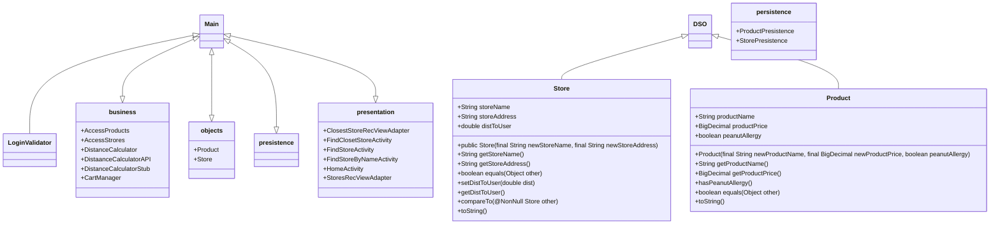

# COMP3350 G06 Iteration 1
## GoCart Architecture
Due: February 10th, 2023

Authors:  Benedict Agupitan, Hridai Mehta, Rishavjot Singh, Ryan Petrillo, Tim Chen

## Layers
| Presentation/UI     |      Logic/Business   	  	 |  Persistence/Data   |
|---------------------|--------------------------------|----------------------|
| Home page           | Access nearby stores	  	 | ProductStub Database |
| Find store by name  | Access Srores by name  	  	 | StoreStub Database   |
| Find nearby stores  | Store Distance calculator	 |                      |
|                     | location Distance calculator   |                      |
|                     | Access products by name		 |                      |
|                     | Access dietary restricted prod |                      |

## Diagram of Layers
