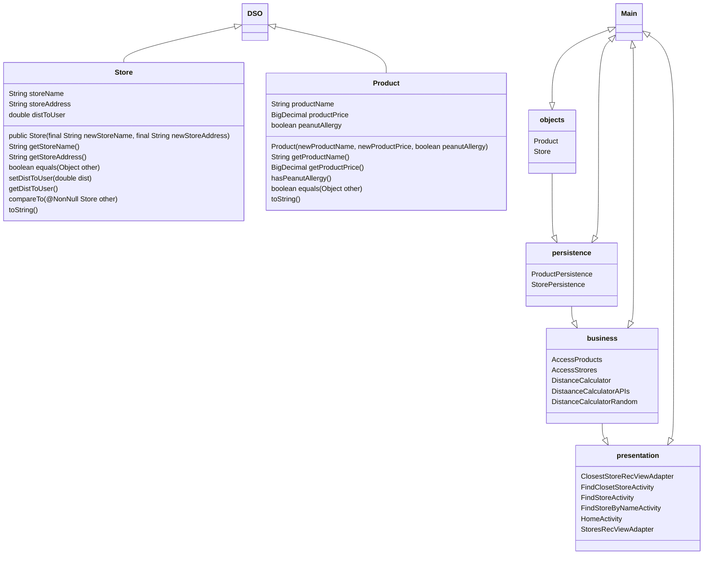

# COMP3350 G06 Iteration 1
## GoCart Architecture
Due: February 12th, 2023

### Packages
* Application
* Business(comp3350.GoCart.objects)
* Objects(comp3350.GoCart.objects)
* Persistence(comp3350.GoCart.persistence)
    * stubs
* Presentation(comp3350.GoCart.presentation)
* Test(comp3350.GoCart.test)
	* Business(comp3350.GoCart.tests.business)
	* Objects(ss(comp3350.GoCart.tests.objects)

### Layers
| Presentation/UI     |      Logic/Business   	  	 |  Persistence/Data   |
|---------------------|--------------------------------|----------------------|
| Home page           | Access nearby stores	  	 | ProductStub Database |
| Find store by name  | Access Srores by name  	  	 | StoreStub Database   |
| Find nearby stores  | Store Distance calculator	 | 				|
| 			    | location Distance calculator   |                      |
| 			    | Access products by name		 |                      |
|                     | Access dietary restricted prod |                      |

### Diagram of Layers
> **Note**:Our class names and their functionalities will be changed to more generic in the next milestone.

### Tier 1 Presentation / User Interface
>This layer generates what the user sees and interacts with. There are currently 6 main classes in the presentation layer, which implements our "find store"
feature. Our UI implements the "Find store" feature and the activities communicate with the logic layer to present it to the user.

### Tier 2 Business / Logic
>This layer perfroms the logic to find the store either by searching by name or by distance(nearest first).
#### AccessProducts
>This class is used to access the products from the persistence layer to work the logic.
#### AccessStores
>This class is used to access the Store from the persistence layer to work the logic.
#### CalculateCheapestStore
>This class is used to implement the user story "find the cheapest order" by finding the cheapest order accross all stores.
#### DistanceCalculator
>This class is used to calculate the distance from the users address to find the nearest stores from their address.
#### DistanceCalculator
>This class is uses a google API to calculate the distance from the users address to find the nearest stores from their address.
#### GetByName
>This class is used to implement the user story "Find store by name" from the persistence  layer to work the logic.

## Tier 3 Data/ Persistence
>This layer has the stub database for Products and Store

